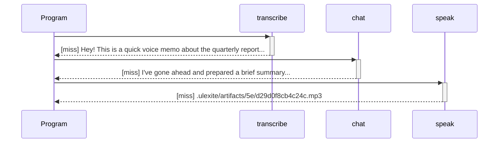

# Debugging

Because every run is checkpointed and traced by default, Ulexite's debugging story is designed around replaying a completed run's trace, not attaching to a live process. That's the right idea for a language where the interesting failures are usually a refused/rate-limited call or a judge that couldn't decide, rather than a segfault — but it's worth being direct about how much of that design is actually built.

**What you get today** is real: every `ulx run` produces a full trace, and `ulx trace`/`ulx replay` let you inspect and reproduce it in detail — one line per capability call, in every output format from a plain listing to a Mermaid sequence diagram to a self-contained HTML page. **What the spec describes beyond that** — a dedicated `ulx debug` command with breakpoints, time-travel, forking a run with modified inputs, and live-attaching to an in-flight conversation — is a future direction. None of it is a real `ulx` subcommand yet. This page walks through both, clearly labeled.

## What's real: inspecting a run via its trace

The actual `ulx` command surface for inspecting a run is `ulx trace` and `ulx replay`, plus every run/approve/deny/replay command's `--output` flag:

```bash
ulx run voice_memo.ulx VoiceMemoReply --arg recording=fixtures/sample.wav --output json
```

```bash
run_id=$(ulx run voice_memo.ulx VoiceMemoReply --arg recording=fixtures/sample.wav --output json | jq -r .run_id)
ulx trace "$run_id" --output mermaid
ulx trace "$run_id" --output jsonl
ulx trace "$run_id" --output html > trace.html
```

`ulx trace` prints a completed run's trace log directly — one record per capability call, oldest first, marking cache status (`[miss]`/`[hit]`/`[err]`). `ulx replay` strictly replays a completed run from that same trace log: a cache miss during replay is an error, never a live provider call, so it's for reproducing a past run's exact dialogue and final value, not for continuing or retrying it.

A trace record carries the request (the actual `system`/`user` messages sent, or a judge's subject/rubric, or an escalation's reason), which provider and model actually served it, the resulting output or error, and a timestamp — everything you need to answer "what exactly did this call send, and what came back" after the fact. Here's a sample `jsonl` record:

```json
{"cache_hit":false,"capability":"chat","error":null,"input":[{"role":"system","text":"You write a one-sentence spoken reply to a voice memo."},{"role":"user","text":"Voice memo transcript:\n Hey! This is a quick voice memo about the quarterly report."}],"kind":"effect","output":"I've gone ahead and prepared a brief summary...","seq":1,"timestamp_ms":1784128850854}
```

And the same run as a Mermaid sequence diagram (`--output mermaid`), which you can paste straight into a Markdown/Mermaid renderer:



For a non-deterministic failure — a refused call, a rate limit, a judge that returned `Escalate` — the trace record's `output`/`error` field carries the exact typed value your program's own `match` would have seen, since these are ordinary typed values (a `Draft<T>`'s unsettled state, a `Verdict`), not exceptions with a stack to unwind. Reading the trace record for the failing step is, today, how you triage that failure — there's no dedicated inspector UI around it yet.

See the [CLI Reference](./tooling/cli-reference.md) for every `--output` format and the full flag list on `run`/`trace`/`replay`.

## What the spec describes, not yet built

Section 19 of the spec lays out a considerably richer debugging model. Here's each piece, and what (if anything) stands in for it today.

### `ulx debug <run_id>` and stepping through a trace

The spec describes `ulx debug <run_id>` loading a completed (or crashed, or suspended-on-`human_approval`) run and letting you step through it forward and backward, with full artifact inspection at every step — a real debugger's mental model applied to a deterministic replay. **There is no `ulx debug` command.** Today you get `ulx trace`, which prints the whole trace at once rather than letting you step through it interactively, and `ulx replay`, which re-executes a run from its trace non-interactively. Neither lets you pause mid-run or inspect a single step's local bindings.

### `breakpoint()` as a language construct

The spec describes a `breakpoint()` statement (and a conditional variant, `breakpoint(verdict is Fail)`) that would suspend interpretation at that IR node under `ulx run --debug` or during replay, exposing the current scope's bindings for inspection. **`breakpoint` isn't a keyword in the grammar at all** — there's no way to write one in a `.ulx` file today, and `ulx run` has no `--debug` flag.

### Time-travel and re-run-from-here (`ulx fork`)

Because every statement is meant to be a checkpoint, the spec describes jumping to any point in a trace and either inspecting state there or re-running from there with modified inputs, via `ulx fork`. **`ulx fork` doesn't exist.** The closest real capability is `ulx run --run-id <id>`, which lets you reuse a specific run id across separate invocations — useful for driving a suspend/resume flow deliberately, but not a way to jump to an arbitrary earlier point in an existing run and branch from it.

### Root-cause navigation across nested conversations

The spec describes the debugger rendering nested conversations (one conversation calling another) as a navigable call stack, keyed off a `parent_run_id` carried by each trace record. **Trace records don't carry a `parent_run_id` field today** — a `TraceRecord` has `run_id`, `seq`, `kind`, `capability`, cache/provider/model metadata, `input`, `output`, `error`, and a timestamp, but nothing linking a child conversation's trace back to its parent's. If your program nests conversations, their calls appear in the trace as ordinary sequential records, not as a navigable call stack.

### Live attach for in-flight conversations

The spec describes `ulx attach <run_id>` connecting to a live execution engine for a long-running or suspended conversation, showing the same view as replay debugging but against actual in-flight state — useful for inspecting a production conversation waiting on a human approval before deciding how to respond. **`ulx attach` doesn't exist.** What's real for a suspended run is the asynchronous suspend/resume flow itself: `ulx run` prints a `suspended: ...` line with resume instructions, and a separate `ulx approve <run_id>`/`ulx deny <run_id>` invocation (possibly from a different terminal, possibly much later) resolves it. That's a real, working mechanism — it just isn't a live-attached debugging view.

### Debugger hooks for tool/provider authors

The spec describes tool and provider adapters registering debug-inspector callbacks exposed identically through `ulx debug`'s UI, so a third-party plugin (say, a vector-store provider) could expose its own "show me the retrieved candidates and their scores" panel without the core debugger needing to know anything about vector stores specifically. Since there's no `ulx debug` UI at all, there's nothing for a plugin to register a panel into.

## What to actually reach for today

Given the above, the practical debugging loop looks like this:

1. Run with `--run-id` so you can find the run again: `ulx run main.ulx MyConv --arg x=1 --run-id debug-1 --mock`.
2. If it suspends, inspect it with `ulx trace debug-1`, then resolve it with `ulx approve debug-1 --value ...` or `ulx deny debug-1`.
3. Otherwise, pull the full trace with `ulx trace debug-1 --output jsonl` (for grepping/`jq`) or `--output html` (for a readable, shareable page).
4. Use `ulx replay debug-1` to reproduce the exact same dialogue and final value deterministically, from the cache — a cache miss there is itself a useful signal that something about the run's inputs or provider config changed since it was recorded.
5. Use `--output mermaid` when you want a shareable diagram of the call sequence rather than a line-by-line log.

For the full design rationale — including the parts not yet built — see [§19 of the spec](https://github.com/JGalego/ulexite/tree/main/docs/spec/19-debugging-model.md).
