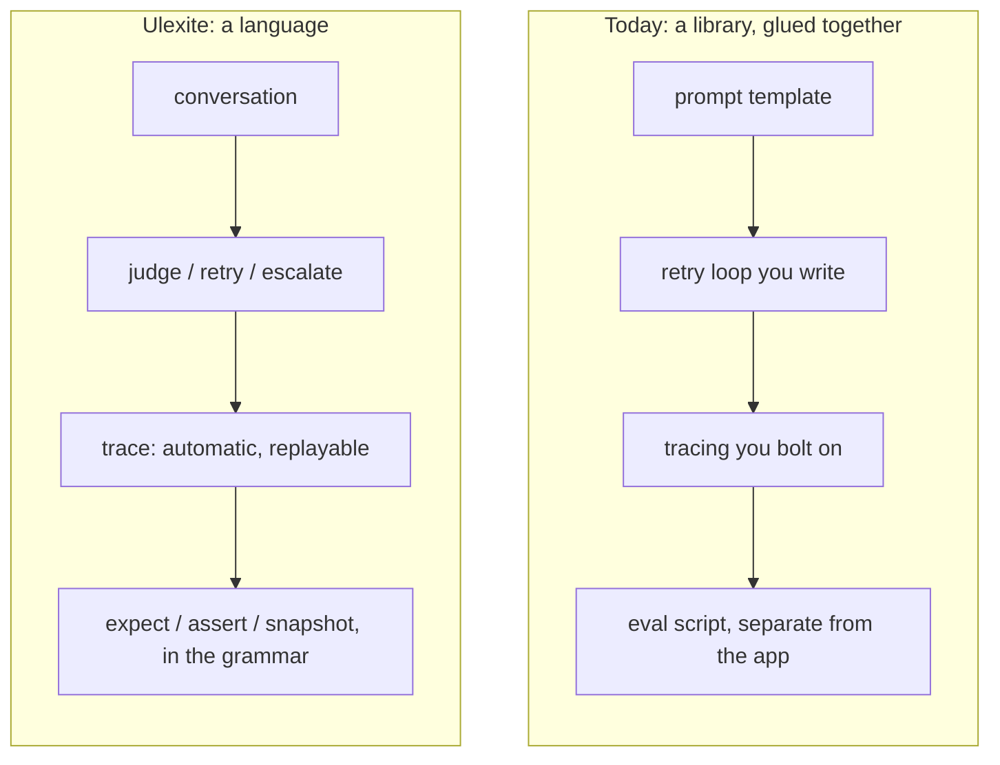

import MockConsole from '@site/src/components/MockConsole';

# Introduction

Ulexite is a programming language whose central abstraction is the **conversation** — not the prompt, not the model, not the agent. It compiles conversations involving humans, LLMs, tools, judges, datasets, and multimodal artifacts to a deterministic execution graph, with reproducible traces and first-class testing built into the grammar rather than bolted on as a library.

## The claim

Every mature computing domain eventually gets a language, not just a library. Relational data got SQL. Infrastructure got Terraform/HCL. Browser automation got Playwright's test runner. Build graphs got Bazel/Starlark. Concurrent, fault-tolerant systems got Erlang/Elixir. In each case, the shift from "a library in a general-purpose language" to "a language with its own grammar, type system, and runtime" happened because the domain had a recurring shape that libraries could approximate but not enforce — and because it needed guarantees (determinism, reproducibility, static checking, a canonical execution model) that a library bolted onto a host language's control flow could never fully deliver.

LLM-driven conversational AI has reached that point. It has a recurring shape: a sequence of turns between typed participants (humans, models, tools, judges), producing typed multimodal artifacts, threaded through automatic history, subject to retries and non-determinism, and increasingly required to be testable, reproducible, and auditable in production. Today that shape gets approximated by a dozen incompatible Python/TypeScript libraries, each reinventing conversation state, retries, tracing, and evaluation as ad hoc application code — because none of them is a language. None has a grammar that can statically reject an unhandled judge verdict. None has a compiler that can prove a multimodal artifact is being routed to a model that actually accepts it. None has a runtime whose replay guarantee is a language-level contract rather than a best-effort SDK feature.



## What Ulexite is

Ulexite has a lexer, a parser, static semantic analysis, an intermediate representation, and a runtime — independent of any single LLM provider. Its central value proposition:

> **The conversation is the unit of compilation and execution.** Everything else — models, tools, judges, artifacts, retries, traces — is a typed participant, message, or effect inside that conversation, checked and scheduled by the compiler and runtime, not hand-assembled by application code.

Concretely, that claim is this whole program — a judge, a conversation, and the retry/escalate shape spelled out as grammar rather than glue code:

```ulexite
judge Fluency(subject: text) -> Verdict {
  rubric: """Is this an accurate, fluent translation of the source? Answer Pass, Fail(reason), or Escalate if you cannot tell."""
}

conversation Translate(source: text, target_lang: text) -> text {
  system: """You are a professional translator."""
  user: """Translate to {target_lang}: {source}"""
  assistant -> draft: text

  match judge Fluency(draft) {
    Pass          => draft
    Fail(reason)  => retry(2) {
                        user: """The previous translation was rejected: {reason}. Try again."""
                        assistant -> draft
                      } else escalate(human_approval, reason: reason)
    Escalate      => escalate(human_approval, reason: "judge could not decide")
    Score(_)      => draft
  }
}
```

It's closer in spirit to Terraform (declare a graph, preview it, apply it, replay it), Playwright (auto-waiting, tracing, and assertions as language primitives, not test-runner conventions), and Gleam/Elixir (sound typing and supervision as defaults, not opt-in patterns) — applied to conversations with and between intelligent, non-deterministic participants.

## What Ulexite is not

- **Not a general-purpose language.** It has no ambition to write web servers or device drivers. It calls out to a host ecosystem (Python, JavaScript, shell) for anything outside its domain, the way SQL calls out to application code for anything outside relational queries.
- **Not a determinism machine for LLMs.** Ulexite doesn't pretend a model call can be made deterministic. It makes the *scaffolding* around the call — retries, validation, routing, tracing, replay of the deterministic parts of a run — deterministic and typed, while treating the model call itself as an explicitly effectful, explicitly non-deterministic primitive.
- **Not trying to out-optimize DSPy or out-orchestrate LangGraph.** Automatic prompt optimization and arbitrary graph topologies are legitimate techniques, and Ulexite's standard library can express versions of both — they're just not the reason the language exists.

## Why now

Three things have changed since the current generation of LLM libraries were designed:

1. **Structured output is now a solved backend problem.** Grammar-constrained decoding proved token-level constraint enforcement works; the technique is now provider-supported (JSON mode, structured outputs, tool-calling schemas) widely enough that a language can assume typed structured output as a baseline, not a research feature.
2. **Multi-turn, multi-agent, multi-provider is the default case, not the exception.** Frameworks like LangGraph and OpenAI's Agents SDK have independently converged on "conversation as a persisted, replayable object" — evidence the industry already wants this, without anyone making it a language-level guarantee instead of an SDK feature.
3. **Evaluation and testing are the operational bottleneck, not the model call.** Tools like Promptfoo and OpenAI Evals prove teams want matrix testing, LLM-as-judge grading, and golden datasets — but they remain config-file test *runners* bolted onto a separate orchestration codebase, rather than a language where `expect`, `judge`, and `dataset` are as native as `if` and `for`.

## What running it looks like

That same `Translate` conversation, actually run against a provider — the judge passes it on the first try here; see [Getting Started](./getting-started.md#try-it-fully-offline) for the retry/escalate path instead:

<MockConsole blocks={[{
  command: 'ulx run translate.ulx Translate --arg source=hello --arg target_lang=fr --provider anthropic',
  lines: [
    {kind: 'turn', emoji: '🧭', role: 'system', tone: 'system', text: 'You are a professional translator.', delayMs: 350},
    {kind: 'turn', emoji: '🧑', role: 'user', tone: 'user', text: 'Translate to fr: hello', delayMs: 400},
    {kind: 'turn', emoji: '🤖', role: 'assistant', tone: 'assistant', text: 'Bonjour', delayMs: 1100},
    {kind: 'turn', emoji: '⚖️', role: 'judge Fluency', tone: 'judge', text: 'Pass', delayMs: 900},
    {kind: 'note', text: 'Bonjour', delayMs: 400},
    {kind: 'rule', delayMs: 250},
    {kind: 'summary', rows: [
      ['run id', '3e9a7c1d5f2b8064'],
      ['status', 'ok'],
      ['capabilities', 'chat, judge'],
      ['provider', 'anthropic — chat (claude-haiku-4-5), judge (claude-sonnet-4-5)'],
    ]},
  ],
}]} loopPauseMs={0} />

Ready to see it in practice? Continue to [Getting Started](./getting-started.md), or jump straight to the [Playground](/playground) to run a conversation against a real local model, live in your browser.

---

This page adapts [§1 Vision](https://github.com/JGalego/ulexite/tree/main/docs/spec/01-vision.md) of the full spec (RFC-0001) — see there for the complete argument, including the prior-art survey and gap analysis this claim is built on.
